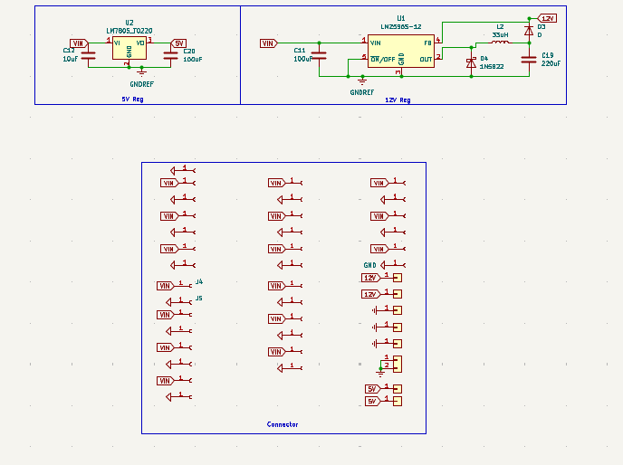
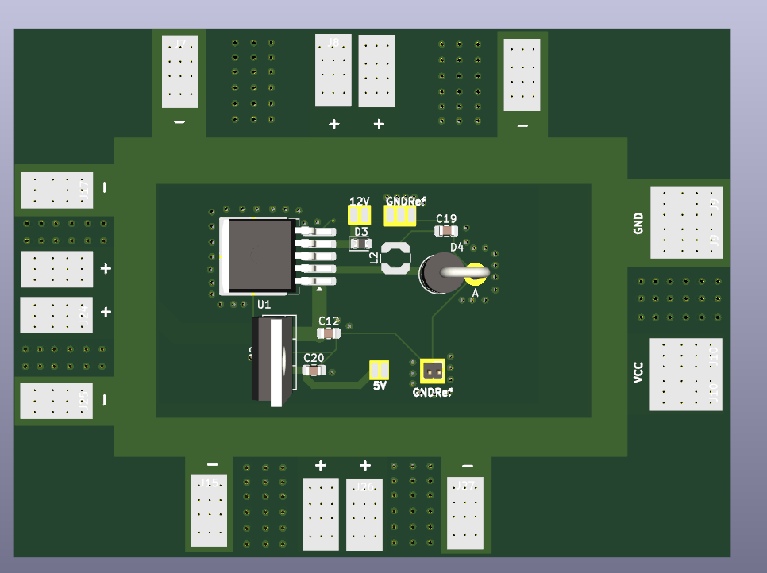

# 🔋 Drone ve Atölye İçin Güç Dağıtım Kartı (PDB)

Bu proje, hem **drone sistemlerinin** güç ihtiyacını karşılamak hem de **elektronik atölyelerinde** kullanılmak üzere tasarlanmış, üretimi kolay ve kararlı bir Güç Dağıtım Kartıdır (Power Distribution Board).

Tasarım, farklı voltaj ve akım gereksinimi duyan modüller için (hem taşınabilir hem sabit uygulamalarda) güvenli ve esnek bir güç çözümü sunar. Özellikle asit baskı yöntemiyle ev ortamında hızlıca üretilebilecek şekilde optimize edilmiştir.

---

##  Proje Görselleri

Tasarımın çizim aşamasından üretim aşamasına kadar olan görselleri aşağıdadır:

|    **Devre Şeması (Schematic)**    |     **PCB Çizimi (Layout)**     |
| :--------------------------------: | :-----------------------------: |
|   |     |
| *LM7805 ve LM2595 Bağlantı Yapısı* | *Asit baskıya uygun yol çizimi* |

|         **3D Render Görüntüsü**         |     **Simülasyon (Simulation)**     |
| :-------------------------------------: | :---------------------------------: |
|               |  |
| *Bileşen yerleşimi ve soğutucu montajı* |          **Kart testleri *          |

---

## 🌟 Teknik Özellikler

u kart, geniş giriş voltajı aralığı ve çift çıkış kanalı (sabit + ayarlanabilir) ile çok yönlü bir kullanım sunar.

| Özellik | Değer / Açıklama |
| :--- | :--- |
| **Giriş Voltajı** | [cite_start]7V - 30V DC [cite: 10] |
| **Sabit Çıkış** | [cite_start]5V / 1.5A (LM7805 ile) [cite: 10, 11] |
| **Ayarlanabilir Çıkış** | [cite_start]1.2V - 25V / 2A (LM2595-ADJ ile) [cite: 10, 11] |
| **Koruma** | [cite_start]Ters kutup, Kısa devre, Aşırı yük koruması [cite: 10, 13] |
| **Üretim Yöntemi** | [cite_start]Asit kazıma (Toner transfer veya UV) [cite: 10, 14] |

---

## 🛠️ Devre Bileşenleri (BOM)

Proje, kolay bulunabilir temel elektronik bileşenler kullanılarak tasarlanmıştır :

* **Regülatörler:** LM7805 (Linear), LM2595-ADJ (Switching)
* **Diyot:** 1N5822 Schottky Diyot
* **İndüktör:** 33µH
* **Kapasitörler:** 470µF ve 100nF
* **Kontrol:** Voltaj ayarı için Potansiyometre
* **Bağlantı:** Terminal Bloklar
* **Soğutma:** Alüminyum profil soğutucu

---

## 🧪 Performans ve Test Sonuçları

Kart üzerinde yapılan laboratuvar testleri ve termal analiz sonuçları şöyledir:

* **Yük Testi:** 28V giriş voltajı altında uzun süreli çalışma testi başarıyla tamamlanmıştır.
* **Termal Analiz:** 1A yük altında 1 saatlik çalışmada (soğutucu ile) maksimum **~55°C** sıcaklığa ulaşmıştır.
* **Ripple (Dalgalanma):** Osiloskop ölçümlerinde çıkış dalgalanması **< 50mV** olarak ölçülmüştür.

---

## 🚀 Uygulama Alanları

Bu kartı aşağıdaki projelerde güç kaynağı olarak kullanabilirsiniz:

1.  **Drone Sistemleri:** Uçuş kontrolcüleri ve çevre birimlerini beslemek için.
2.  **Atölye Güç Kaynağı:** Prototip devreler için ayarlanabilir DC kaynak.
3.  **Gömülü Sistemler:** Test kartları ve sensör beslemeleri.
4.  **Aydınlatma:** Mobil şarj üniteleri ve LED sürücü devreleri.

---

## 📂 Dosya Yapısı

* `/Schematic` - Devre şeması ve PDF çıktıları.
* `/PCB` - Asit baskı için hazır PCB çizimleri (Gerber/PDF).
* `/Image` - Proje görselleri ve test fotoğrafları.

---

## 👨‍💻 Geliştirici

**Salih Tekin Ayvacı** 
* 📍 İstanbul, Türkiye 

Projeyle ilgili soru ve önerileriniz için LinkedIn veya GitHub üzerinden iletişime geçebilirsiniz.
